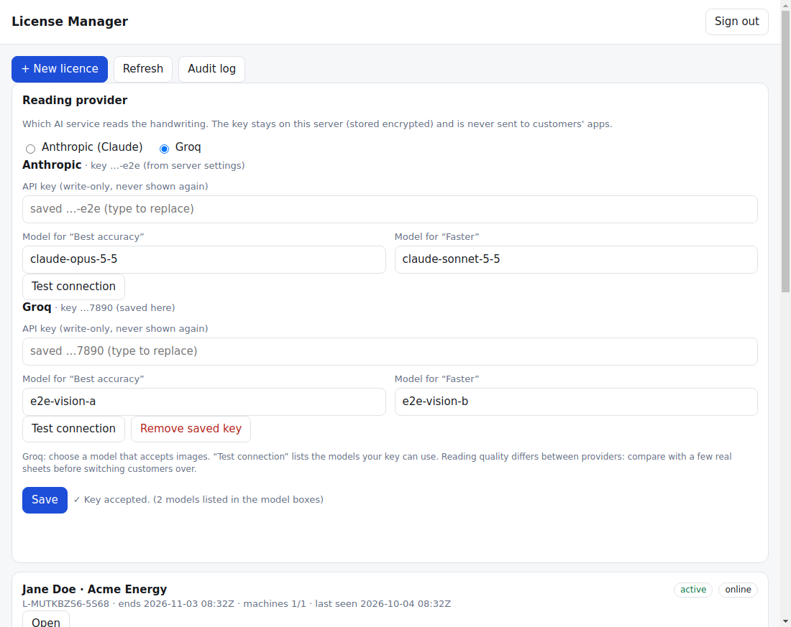

# Admin guide (for you, the licence owner)

* Concepts, key generation, offline codes, rotation and "a key leaked": **[LICENSING.md](LICENSING.md)**
* Server setup, TLS, backups: **[DEPLOYMENT.md](DEPLOYMENT.md)**

## Day to day: License Manager (`https://<server>/manager`, works on a phone)
Sign in with the admin token (kept in the page's memory only).
| Task | How |
|---|---|
| **Import a code** | paste a code made with `scripts/offline-license.sh` → *Import*. Recommended: your signing key never touches the server. |
| **Create a code on the server** | only if you gave the server a signing key (`LICENSE_SIGNING_KEY_FILE`); otherwise the form says so. The code is shown once with a Copy button. |
| **Revoke / Suspend / Reinstate** | *Open* the licence. The reason you type is shown to the customer. Takes effect on the customer's **next page read** and at their next validation (≤ 30 min online). An offline PC that never connects is not reached until it does. |
| **Renew / Extend** | *Renew* = set a date (or never); *Extend* = add days. The server's date wins for online licences. |
| **Allow replacement / Authorise machine / Reset** | for a customer who changed PC: let the next new PC replace the old one, authorise a specific Machine ID beyond the limit, or free all activations. |
| **Grace period** | how long an online licence may stay offline (default 168 h), per licence. |
| **Usage / Audit** | page reads with model and **tokens in/out**; every admin action and every activation attempt. |

Same actions with only bash + curl (no Node): `scripts/license-admin.sh` (see the header of the script).

## Reading provider: Anthropic or Groq
In the License Manager, the **Reading provider** card chooses which AI service reads the handwriting, and holds its API key:
1. Pick **Groq**, paste the **Groq API key** (create one in the Groq console), and choose the models for *Best accuracy* and *Faster*. The key box is write-only: after saving you only see the last 4 characters.
2. Press **Test connection**: it asks Groq which models your key can use (no page is read, nothing is billed) and fills the model boxes' suggestions. Choose a model that **accepts images**; a model without vision fails with "could not accept this page".
3. **Save.** From the next page read, every customer's app reads through Groq; the apps themselves are unchanged and never see any API key. Switch back to Anthropic the same way. **Remove saved key** deletes a key from the server.

The same can be set with environment variables (`PROVIDER`, `GROQ_API_KEY`, `GROQ_MODEL_BEST/FAST`, see `.env.example`); keys saved in the Manager take precedence.

* Keys saved in the Manager are **encrypted in the database** with a key derived from the server's receipt key file, so a copy of a backup does not expose them. Anyone with the admin token can replace or remove a key; protect it like a password.
* **Quality and cost differ between providers.** The reading prompt was tuned with Claude; Groq's vision models may read handwriting less accurately. Compare with real sheets before switching customers: use `npm run local` with `GROQ_API_KEY` set, then `npm run accuracy` to get a per-column report against your typed answers. The usage log shows tokens per page for either provider.
* Groq's model names, image limits and prices change: check the Groq console. This integration follows Groq's OpenAI-compatible API but could not be tested against the live service from the build environment (only against a stub), so run **Test connection** and one real page before relying on it.

## Customer messages
| They see | Meaning / what you do |
|---|---|
| "not a valid activation code" / "damaged or altered" | typo or truncated copy; send the code again as a file/attachment |
| "signed with a key this version does not know" | they need the newer app version (key rotation) |
| "already active on N computers" | *Allow replacement*, *Reset*, or raise the limit (new code) |
| "belongs to another computer" | offline code is machine-bound: ask for their Machine ID and make a new code |
| "License expired…" | *Renew/Extend* (online) or issue a new code |
| "revoked/suspended" + your reason | you did that; *Reinstate* to undo |
| "reading provider rejected the server's API key" / "model was not found" | the key or model in **Reading provider** is wrong or expired: fix it there |
| "Monthly quota of N pages reached" | `pagesPerMonth` in the code's features; issue a new code or wait for the 1st (UTC) |

## Releasing a new app version
Repo variables/secrets: see DEPLOYMENT.md §6. Raise `version` in `app/package.json`, commit, tag `vX.Y.Z`, push the tag: GitHub Actions builds, runs the release gate (production keys present, no development keyring in the bundle, https server URL) and publishes `Lighting Survey Reader Setup.exe` / `Lighting Survey Reader.exe`. Installed apps update themselves; the portable exe is replaced by hand.

## What it costs
* **VPS**: a few US$ per month.
* **Anthropic**: pay per token; **measure, do not guess**: the usage log lists exact tokens in/out and the model for each page, so cost per page = tokens_in × input price + tokens_out × output price from the current Anthropic price list. "Faster" costs less than "Best accuracy" (`MODEL_BEST`/`MODEL_FAST` in `server.env`). Set a spending limit in the Anthropic console and use `--pages-per-month` to cap a customer.
