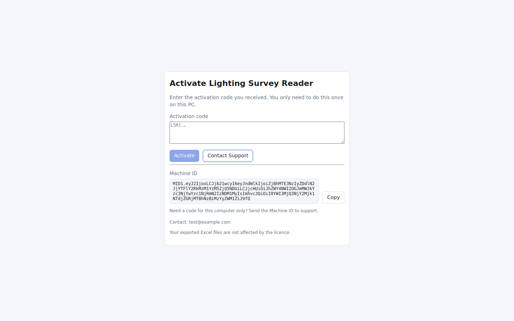
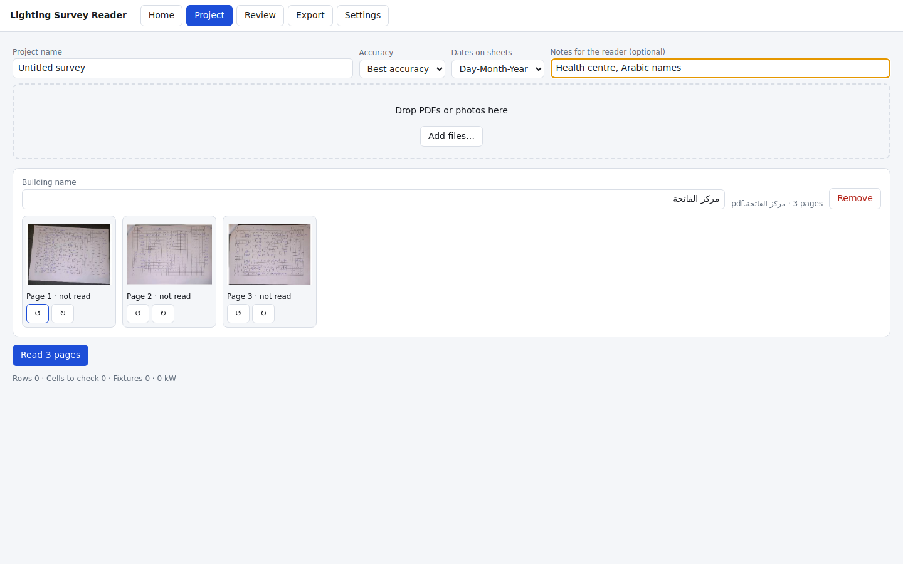
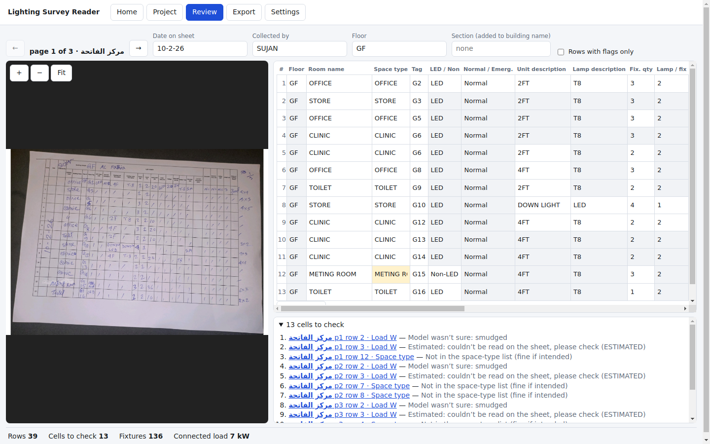
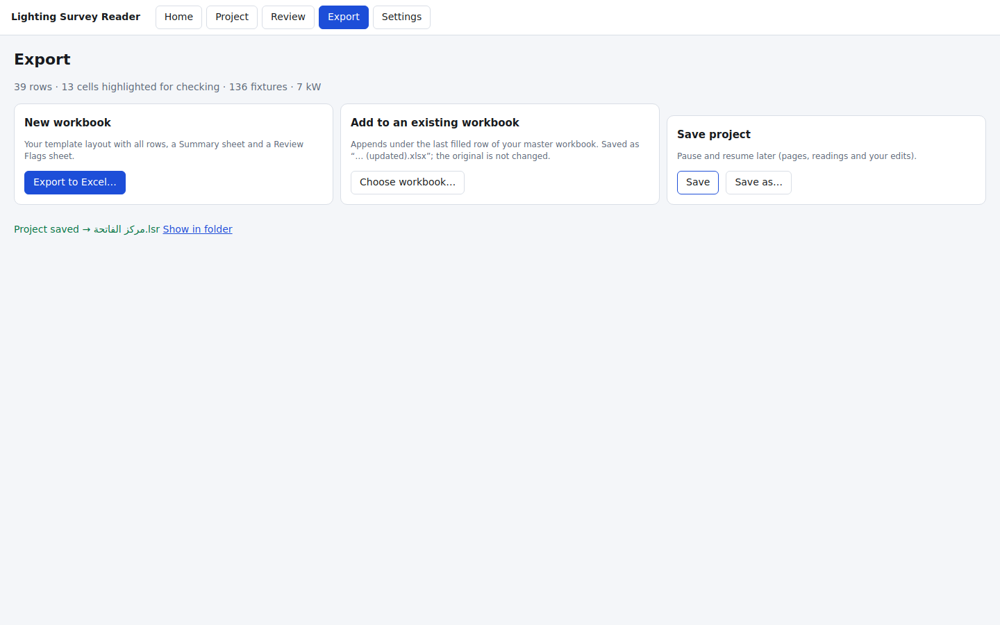
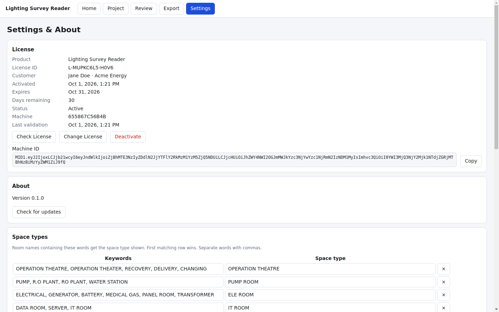
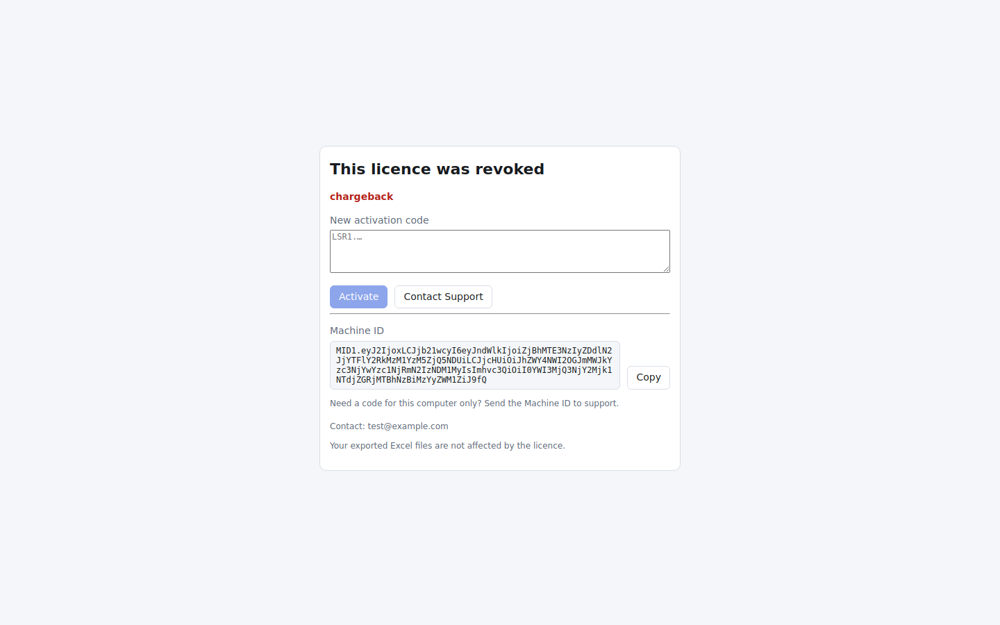

# Lighting Survey Reader: quick guide

Turns photographed or scanned lighting-survey sheets into your Excel template.

## 1. Install (once)
Run **Lighting Survey Reader Setup.exe** (installs just for you, no administrator rights), or start **Lighting Survey Reader.exe** (portable, nothing to install).

> **Windows may show “Windows protected your PC” (SmartScreen).** It happens for new programs that are not yet signed with a paid publisher certificate. Click **More info → Run anyway**, but only for a file you received directly from your supplier.

## 2. Activate (once)
Paste the **activation code** you were given (a long text starting with `LSR1.`) and press **Activate**.

* Your supplier may ask for the **Machine ID** shown on this screen: press **Copy** and send it. They reply with a code made for this computer only, which works **even without internet** (page reading still needs internet).
* **Contact Support** opens a message to your supplier.
* Online licences re-check themselves when you open the app and every 30 minutes; without internet they keep working for a grace period (a warning bar appears when a check is overdue).

## 3. Read a survey
1. **New project** → **Add files…** (or drag PDFs/photos in). Arabic file names are fine. Sideways scans are turned upright automatically; use ↺ ↻ if a page is still wrong.
2. Check the **Building name** (column E) and choose **Best accuracy** or **Faster**. An optional note such as “Primary school, Arabic room names” helps the reader.
3. Press **Read pages**. You can **Stop** any time; a failed page has its own **Try again**.

## 4. Review
| Colour | Meaning |
|---|---|
| **Yellow** | Please check: the reader was unsure, or **estimated** an unreadable value (hover for the reason) |
| **Light blue** | Blank on the sheet, copied from the row above |
| **Grey** | Copied from a ditto mark |

Click a cell to correct it; change a value and every ditto below follows. Type `/` to make a ditto again. Click a line under **cells to check** to jump to it. Keys: ↑ ↓ / Enter between rows, **Alt + ← →** change page.

## 5. Export and save
**Export** → **New workbook** (your template layout + *Summary* and *Review Flags*), or **Add to an existing workbook** (appends under the last filled row; saved as “… (updated).xlsx”; the original is untouched). **Save project** lets you continue later. Any problem with files or disk is shown on screen.

## 6. Your licence
**Settings → License** shows the licence ID, customer, activation date, expiry, **days remaining**, status, machine and last validation. Buttons: **Check License**, **Change License** (enter a new code), **Deactivate** (asks to confirm; frees the activation so you can use another PC).

## If the app locks

The screen says why: **License expired. Please enter a valid activation code.**, **revoked/suspended** (contact your supplier), **already active on N computers** (deactivate on the old PC first), **belongs to another computer** (send your Machine ID for a new code), or **connect to the internet** (the offline period ended; also check the PC date/time). Your exported Excel files are never affected.
